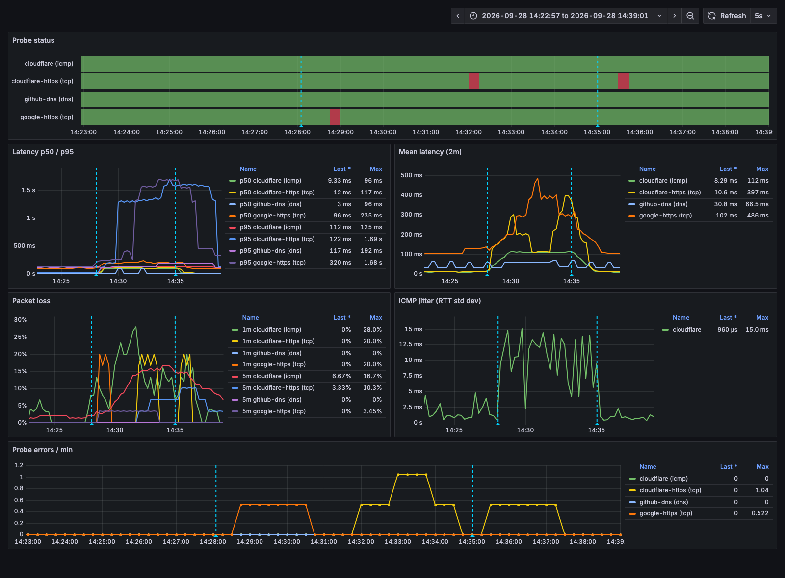
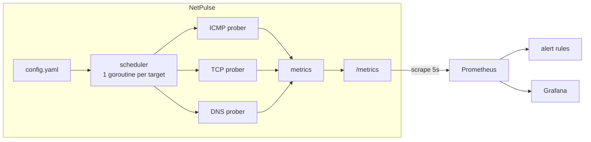
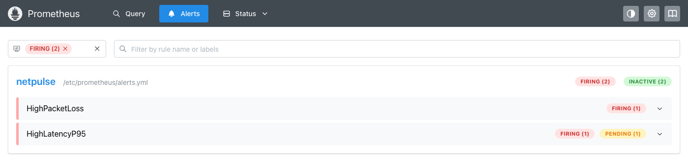
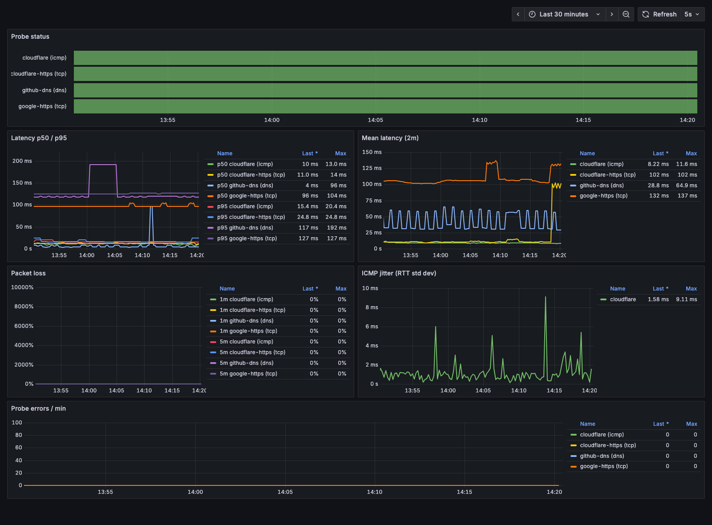
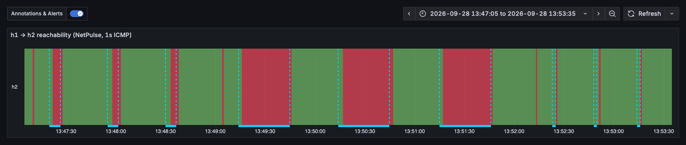

# NetPulse

A concurrent network prober in Go. It measures **latency, jitter and packet loss** over **ICMP, TCP and DNS**, exports Prometheus metrics, alerts on outages, loss and p95 latency, and is validated against real network faults injected with `tc netem`.


*Race-enabled tests, live metrics from the running exporter, and the BGP lab summary. Recorded with [vhs](https://github.com/charmbracelet/vhs) from [`docs/demo.tape`](docs/demo.tape).*



*A 7-minute `tc netem` fault (100ms delay, 10% loss; [run 2 below](#fault-injection)). The dashed lines mark netem ON and OFF. ICMP mean RTT steps up by about 100ms and loss climbs. TCP p95 jumps past 1.5s as dropped SYNs are resent after the 1s RTO. The short red blocks on the status panel are TCP probes where the SYN **and** its retransmit were both dropped (about 1% odds at 10% loss), so the handshake missed its 2s timeout.*



## Quickstart

```bash
docker compose up --build
```

| Service | URL |
|---|---|
| NetPulse metrics | http://localhost:9101/metrics |
| Prometheus (targets, alerts) | http://localhost:9090 |
| Grafana dashboard (anonymous view; admin/admin to edit) | http://localhost:3000/d/netpulse |

Run without Docker:

```bash
go run ./cmd/netpulse -config config.yaml
curl -s localhost:9101/metrics | grep netpulse_
```

Tests:

```bash
go test ./... -race
```

## Configuration

```yaml
listen_addr: ":9101"
targets:
  - name: cloudflare        # unique; becomes the `target` label
    type: icmp              # icmp | tcp | dns
    address: 1.1.1.1        # host (icmp, dns) or host:port (tcp)
    interval: 10s           # default 10s
    timeout: 3s             # default 2s; must be < interval
    count: 5                # icmp packets per probe, sent 200ms apart; default 3
    ip_version: 4           # icmp and tcp; 4 (default) or 6
```

Config is validated at startup. Duplicate names, unknown types, `timeout >= interval`, and ICMP counts that can't all be sent within the timeout are all rejected.

## What each probe measures

| Type | Latency is | Notes |
|---|---|---|
| `icmp` | Mean RTT of `count` echo requests | Also exports jitter (RTT std dev). Uses unprivileged ping sockets. |
| `tcp` | Time to complete the 3-way handshake | Name resolution happens **before** the clock starts, so DNS time isn't counted. Roughly 1 RTT plus the server's accept time. |
| `dns` | Time for the system resolver to return an answer | Measures whatever resolver the host is configured with, caches included. |

## Metrics

All series carry `target` and `type` labels.

| Metric | Kind | Meaning |
|---|---|---|
| `netpulse_probe_up` | gauge | 1 if the last probe succeeded |
| `netpulse_probe_latency_seconds` | histogram | Probe latency, buckets 1ms to 2s |
| `netpulse_icmp_jitter_seconds` | gauge | RTT std dev of the last ICMP probe |
| `netpulse_packets_sent_total` | counter | Packets (ICMP) or attempts (TCP, DNS) sent |
| `netpulse_packets_received_total` | counter | Replies received |
| `netpulse_probe_errors_total` | counter | Probes that returned an error |

### Useful PromQL

```promql
# Packet loss over 5m
1 - increase(netpulse_packets_received_total[5m]) / increase(netpulse_packets_sent_total[5m])

# p95 latency per target
histogram_quantile(0.95, sum by (le, target, type) (rate(netpulse_probe_latency_seconds_bucket[5m])))

# Mean latency over 1m
rate(netpulse_probe_latency_seconds_sum[1m]) / rate(netpulse_probe_latency_seconds_count[1m])
```

## Alerts

Defined in [`deploy/alerts.yml`](deploy/alerts.yml).

| Alert | Condition | For |
|---|---|---|
| `NetPulseDown` | Prometheus can't scrape NetPulse | 30s |
| `TargetDown` | Last probe failed | 1m |
| `HighPacketLoss` | Loss > 5% over 5m, with at least 20 packets/attempts in the window | 1m |
| `HighLatencyP95` | p95 > 200ms over 5m | 2m |

The 20-sample floor on `HighPacketLoss` keeps low-rate targets from paging on noise. A TCP target at a 10s interval sends 30 attempts per 5m, so one failure is 3.3% and two is 6.7%. DNS targets at 30s (10 per 5m) never meet the floor; `TargetDown` covers them.

## Fault injection

[`scripts/fault-inject.sh`](scripts/fault-inject.sh) runs `tc netem` inside the NetPulse container's network namespace. While the fault is held it polls Prometheus for alerts. When it finishes it writes a report to `results/` with time-to-detect and before/during latency and loss.

```bash
scripts/fault-inject.sh "delay 100ms 20ms loss 10%" 420
```

netem only shapes **egress** on `eth0`, so the added delay counts once per round trip. A lost packet is a lost request.

### Results

Run 1: `delay 100ms 20ms loss 10%`, held for 7 minutes, against a 7-minute clean baseline ([raw report](results/20260928-115821-fault.md)).

**Time to detect** (from injection; alerts polled every 5s):

| Alert | Pending | Firing |
|---|---|---|
| `HighLatencyP95` google-https (tcp) | 40s | **161s** |
| `HighPacketLoss` cloudflare (icmp) | 101s | **161s** |
| `HighLatencyP95` cloudflare-https (tcp) | 171s | **297s** |
| `TargetDown` | never | never |

**Measured impact** (7-minute windows):

| Target | Mean before → during | p95 before → during | Loss before → during |
|---|---|---|---|
| cloudflare (icmp) | 9.7 → 112.8 ms | 15.8 → 127.9 ms | 2.4% → **9.3%** |
| cloudflare-https (tcp) | 10.5 → 185.9 ms | 15.6 → **1348 ms** | 0% → 0% |
| google-https (tcp) | 104.8 → 258.3 ms | 124.8 → 255.8 ms | 0% → 0% |
| github-dns (dns) | 43.6 → 48.4 ms | 119 → 173 ms | 0% → 0% |

Run 2, repeated later on a quieter network, with Grafana annotations ([raw report](results/20260928-142757-fault.md)):

| Alert | Pending | Firing |
|---|---|---|
| `HighLatencyP95` google-https (tcp) | 20s | **136s** |
| `HighPacketLoss` cloudflare (icmp) | 126s | **186s** |
| `HighLatencyP95` cloudflare-https (tcp) | 116s | **236s** |
| `HighPacketLoss` cloudflare-https (tcp) | 297s | **357s** |
| `TargetDown` google-https, cloudflare-https (tcp) | 55s, 246s | never (cleared within 1m) |

| Target | Mean before → during | p95 before → during | Loss before → during |
|---|---|---|---|
| cloudflare (icmp) | 8.8 → 110.1 ms | 15.5 → 124.8 ms | 2.0% → 14.1% |
| cloudflare-https (tcp) | 10.1 → 242.4 ms | 16.0 → 1638 ms | 0% → 4.8% |
| google-https (tcp) | 109.7 → 304.9 ms | 126.3 → 1523 ms | 0% → 2.4% |
| github-dns (dns) | 38.0 → 52.9 ms | 118 → 166 ms | 0% → 0% |

Across the two runs, the first alert fired after **136–161s**, and packet loss was detected after **161–186s**.



*About 3.5 minutes into run 2: `HighPacketLoss` and `HighLatencyP95` firing. `TargetDown` went pending on the TCP blips but never fired, because no target stayed down for its full minute.*

What this shows:

- **ICMP matched the injected fault.** Mean RTT rose by about 101–103ms (100ms injected). Loss measured 9.3% and 14.1% against 10% injected, on top of the home link's 2% ambient loss. With about 210 packets per run, sampling error is roughly ±2 points, so run 2 sits at the high end.
- **TCP turns loss into latency.** In run 1 the TCP probes reported **0% loss**, while their p95 jumped from 16ms to 1.35s. Run 2 lost 1–2 of about 42 handshakes, the ~1% where both the SYN and its retransmit were dropped. A dropped SYN isn't a failed connect. The kernel resends it after the 1s initial RTO, the handshake still completes inside the 2s timeout, and the probe succeeds, just slowly. A TCP-only monitor would never show this fault as loss. Watching TCP p95 alongside ICMP loss does.
- **p95 is noisy at low sample counts.** Both TCP targets had the same 10% SYN loss, but only cloudflare-https's p95 crossed 1s. At 6 probes a minute, a 5-minute window holds about 30 samples, so p95 depends on whether 1 or 2 of them hit a retransmit. google-https fired sooner only because its 104ms baseline plus 100ms crossed the 200ms threshold straight away.
- **DNS was barely affected, and that's expected.** The container resolves through Docker's embedded resolver at `127.0.0.11` on the loopback interface. Docker Desktop forwards those queries from the host, so they never cross the container's `eth0`, which is where netem was applied. To impair DNS, shape `lo`, or point the prober at an external resolver.
- **`TargetDown` correctly stayed quiet.** Every target was still reachable. The fault showed up as degradation, not an outage.
- **Detection took 2.3 to 3.1 minutes, and that comes from the rule design.** Loss is judged over a 5-minute window, so a 10% fault needs roughly 100–120s of data before the window average passes 5%, and then the rule waits another `for: 1m`. Shorter windows would fire faster but page on brief blips. That tradeoff is deliberate.

## BGP convergence lab

[`lab/bgp/`](lab/bgp/) is a containerlab topology: three FRRouting routers in an eBGP triangle, with NetPulse probing across it. The direct link is failed *silently* (a blackhole with the carrier still up, not `ip link down`), and the outage is measured until BGP moves traffic to the backup path:

| Mode | Outage (mean of 3) |
|---|---|
| Default timers (keepalive 60s, hold 180s) | **169.8s** |
| Tuned timers (3s / 9s) | **6.5s** |
| BFD, FRR defaults | **30.9s** |
| BFD + `strict hold-time 1` | **1.9s** |


*NetPulse's 1s ICMP probe from h1 to h2 while the direct r1–r3 link is silently black-holed. Each shaded region under the timeline is one failure. From left to right: **default** timers (170s), three **tuned** 3/9s runs (6.5s), three **BFD** runs (31s, because of FRR's 30s BFD hold), and three **BFD strict** runs (1.9s). The thin red slivers between runs are the deliberate `clear bgp` resets when the mode changes, and the switch back to the direct link after it heals.*

Enabling BFD alone didn't deliver sub-second failover. FRR 10.4 detected the failure in 0.9s but then waited a 30s "BFD hold time" before resetting the session. The lab also showed that `ping` can't be trusted to measure outages, because it backs off while replies go unanswered. See the [lab README](lab/bgp/README.md) for setup, method and findings.

## More screenshots

| Steady state | BGP fast modes, zoomed |
|---|---|
|  |  |

## Findings

### TCP connect time vs ICMP RTT

In the first run, the TCP handshake to `google.com:443` took **~104ms**, while ICMP to `1.1.1.1` took **~8ms**. That looked like a bug in the TCP prober. It isn't:

| Check | Result |
|---|---|
| `ping` the same Google IPv4 address | 102–105ms |
| `curl` connect time to that address | 106ms |
| TCP to `1.1.1.1:443` | ~6ms |
| `traceroute` to the Google IP | ~5ms for 7 hops, then 101ms at the final hop |
| Reverse DNS of the Google IP | `prg03s12-in-f14.1e100.net` |

The handshake time matches the ICMP RTT to the same host. The gap was between hosts, not protocols. Cloudflare's anycast answers from a nearby PoP. `google.com` resolved to a far-away frontend, reached over a path whose long-haul hop doesn't show up in traceroute. That's why the config now includes `cloudflare-https`, a TCP probe against the same host as the ICMP probe, so the two protocols can be compared directly.

The same investigation turned up a real bug. The resolver returned four IPv6 addresses for `google.com`, and this host has no IPv6 route, so every one of them failed with `connect: no route to host`. Picking `ips[0]` only worked because the IPv4 answer happened to come first. Probes now resolve an explicit address family (`ip_version`, default 4).

### Bufferbloat during image pulls

On the first `docker compose up`, NetPulse showed **12.6% ICMP loss** and a **~1s TCP p95** to Cloudflare, with no fault injected. `HighPacketLoss` and `HighLatencyP95` both fired. Losses came in bursts over about 3.5 minutes and then stopped. That lined up exactly with pulling the `golang` (~800MB) and `netshoot` images over the same home connection. The ~1s TCP latency is the signature of a lost SYN being resent after the 1s initial timeout. Once the downloads finished, loss went back to 0% and TCP to ~6ms.

## Design decisions

**Histogram, not summary, for latency.** Histogram buckets can be summed across instances and give percentiles in PromQL. Summary quantiles are computed on the client and can't be aggregated.

**Loss from counters, not a gauge.** A "loss in the last probe" gauge only tells you about one probe, and Prometheus samples it at whatever instant it scrapes. Sent/received counters give correct loss over *any* window with `increase()`. Every counter is initialised to 0 at startup so `rate()` has a baseline from the first scrape.

**Unprivileged ICMP instead of raw sockets.** Ping sockets (`SOCK_DGRAM` + `IPPROTO_ICMP`) need no root and no `CAP_NET_RAW`. The kernel handles the echo ID, and only replies to our own socket come back. Raw sockets would allow custom packets but need elevated privileges. NetPulse runs as `nonroot` in a distroless image. Docker sets `net.ipv4.ping_group_range` so ping sockets work inside the container. macOS supports them out of the box.

**One goroutine per target.** Each target has its own ticker, so a slow or timing-out target never delays the others. Goroutines cost a few KB each, and nearly all their time is spent blocked on I/O, so hundreds of targets is trivial. Each target waits a random offset within its interval before its first probe, so N targets don't fire in the same instant and stay phase-locked.

**Timeouts are bounded end to end.** Every probe runs under a context deadline that covers resolution too, so a slow resolver can't push a probe past its timeout. `timeout < interval` is enforced so probes of the same target never overlap.

## Project layout

```
cmd/netpulse/          entrypoint: config, HTTP server, signal handling
internal/config/       YAML loading and validation
internal/probe/        Prober interface + ICMP, TCP, DNS implementations
internal/metrics/      Prometheus collectors
internal/scheduler/    per-target goroutines
deploy/                Prometheus config, alert rules, Grafana provisioning
scripts/               fault injection
lab/bgp/               BGP convergence lab (containerlab + FRR)
docs/GUIDE.md          original build guide and deviations from it
```

## Roadmap

- [x] Phases 1–3: probers, metrics, scheduler
- [x] Phase 4: Prometheus, Grafana, alerts, fault injection
- [x] Demos and screenshots (top of this README)
- [x] Phase 5: BGP convergence lab (FRRouting + containerlab): default timers vs tuned vs BFD
