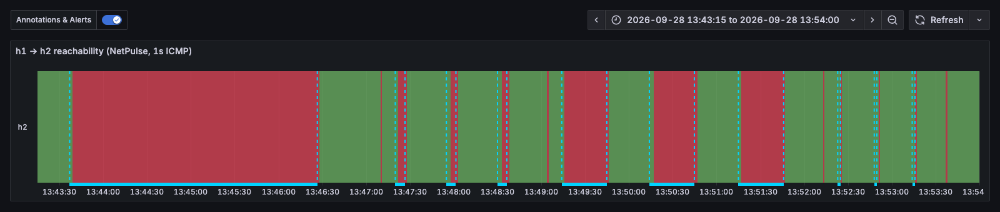

# BGP convergence lab

Three FRRouting routers in an eBGP triangle, a host behind r1 and r3, and NetPulse probing across it. The direct r1–r3 link is failed silently, and the lab measures how long traffic is black-holed before BGP moves it to the backup path through r2.

```
            r2 (AS65002)
           /            \
    10.0.12.0/30    10.0.23.0/30
         /                \
    r1 (AS65001) ------- r3 (AS65003)
         |   10.0.13.0/30   |
    h1 192.168.1.10     h2 192.168.3.10
    (NetPulse)
```

- **Primary path h1 → h2:** r1 → r3 (AS path `65003`)
- **Backup:** r1 → r2 → r3 (AS path `65002 65003`), already in r1's BGP table, so failover is purely a detection problem.

## Run it

Needs a Linux host or VM with Docker and [containerlab](https://containerlab.dev). On macOS, use [OrbStack](https://orbstack.dev):

```bash
# once, on the Mac
brew install --cask orbstack
orb create ubuntu:noble clab
orb -m clab -u root bash -c 'curl -sL https://containerlab.dev/setup | bash -s "all"'

# build NetPulse for the lab (from the repo root)
CGO_ENABLED=0 GOOS=linux GOARCH=arm64 go build -o lab/bgp/bin/netpulse ./cmd/netpulse

# deploy and measure (inside the VM; OrbStack mounts /Users at the same path)
orb -m clab -u root
cd /Users/<you>/.../netpulse/lab/bgp
containerlab deploy -t topology.clab.yml
./convergence.sh 3                # 3 runs each of default, tuned, bfd, bfd-strict
containerlab destroy -t topology.clab.yml
```

While the lab is up, Prometheus is at `http://<vm-ip>:9090`. Grafana is at `http://<vm-ip>:3000`, with the reachability timeline at `/d/bgp-convergence` and the full NetPulse dashboard at `/d/netpulse`. Get the VM's IP with `orb list`.

Useful commands:

```bash
docker exec clab-bgp-r1 vtysh -c "show bgp ipv4 summary"
docker exec clab-bgp-r1 vtysh -c "show bgp ipv4 unicast 192.168.3.0/24"
docker exec clab-bgp-r1 vtysh -c "show bfd peers"
docker exec clab-bgp-h1 traceroute -n 192.168.3.10
```

## How the failure is injected

```bash
tc qdisc replace dev eth2 root netem loss 100%    # on r1 and r3
```

**Not** `ip link set eth2 down`. With the interface down, FRR's `fast-external-failover` resets the directly connected eBGP session at once, and a veth pair takes the far end down too. Every mode would converge instantly and the timers would never be tested. A blackhole keeps the carrier up, which is how most real failures look: a dead transceiver on a middle box, a wedged line card, a provider fault. Only keepalives or BFD can notice.

## How the outage is measured

- **Ground truth:** `fping` from h1 to h2 every 20ms. The outage is the longest gap between two consecutive replies.
- **Monitoring view:** NetPulse on h1 probes h2 every 1s (`count: 1`). The report shows how many of those probes were lost, so you can see how a 1s monitor resolves each outage.

## Modes

| Mode | Config | Expected detection |
|---|---|---|
| `default` | FRR traditional: keepalive 60s, hold 180s | 120–180s (hold time minus time since the last keepalive) |
| `tuned` | `neighbor X timers 3 9` | 6–9s |
| `bfd` | `neighbor X bfd` (300ms × 3), default BGP timers | ~0.9s BFD **+ 30s FRR BFD hold time** |
| `bfd-strict` | `neighbor X bfd strict hold-time 1` | ~0.9s BFD + 1s |

## Results

3 runs per mode ([raw report](../../results/20260928-133143-bgp.md)). Outage = the longest gap in 20ms fping replies from h1 to h2.

| Mode | Outage (mean of 3) | Range | NetPulse 1s probes lost | vs default |
|---|---|---|---|---|
| `default` (60/180s) | **169.8s** | 169.6–169.9s | 170 | — |
| `tuned` (3/9s) | **6.5s** | 6.4–6.7s | 6–7 | 26× faster |
| `bfd` (300ms × 3, FRR default hold) | **30.9s** | 30.8–31.0s | 31 | 5.5× faster |
| `bfd-strict` (hold-time 1) | **1.9s** | 1.8–1.9s | 2 | **91× faster** |



*NetPulse's 1s probe from h1 to h2. From left to right: default (170s), tuned ×3 (6.5s), BFD ×3 (31s), BFD strict ×3 (1.9s). The thin slivers between runs are the deliberate `clear bgp` resets between modes, and the switch back to the direct link after it heals.*

Reading the numbers:

- **`default` ≈ 180s hold − ~10s.** The hold timer runs from the last keepalive received, so in general the outage is anywhere from 120s to 180s. Here every run landed at about 170s. The script fails the link at a fixed point after the sessions reset, so the keepalive phase was the same each time. On a live network, expect the full range.
- **`tuned` ≈ 9s hold − ~2.5s**, for the same reason.
- **`bfd` ≈ 0.9s detection + 30s FRR BFD hold time.** BFD alone took 32 times longer than it had to (see below).
- **`bfd-strict` ≈ 0.9s detection + 1s hold.** This is the only mode where detection, not configuration, sets the outage.
- **NetPulse agreed with fping to within 1 probe** in every run. A 1s monitor is enough to measure convergence at this scale.

## Findings

### BFD detected in under a second, but BGP waited 30 seconds

In the first `bfd` run, traffic was black-holed for as long as the failure lasted. The per-second trace on r1 showed:

```
1034ms   nexthop=10.0.13.2  bgp=Established  bfd=down
31374ms  nexthop=10.0.12.2  bgp=Idle         bfd=down    <- 30s later
```

bfdd declared the peer down after 3 missed 300ms packets and told bgpd at once (`bfd state Up -> Down` in the debug log). But FRR 10.4's bgpd doesn't stop the session on that event. It starts a **BFD hold timer**, shown as `BFD Hold Time (interval 30)` in `show bgp neighbor`, and only resets the session when the timer expires. Setting `neighbor X bfd strict hold-time 1` brings detection-to-failover down to about 2s.

The lesson: turning BFD on is not enough. Check what the BGP implementation *does* with a BFD Down event, and measure it end to end.

### vtysh stops at the first failing command

`vtysh -c A -c B -c C` stops at the first command that errors, and `no neighbor X timers 3 9` errors when no timers are set. An early version of the script therefore never ran the `neighbor X bfd` that came after it, and the first `bfd` "result" was really default timers. `convergence.sh` now runs one command per vtysh call.

### `ping` is the wrong tool for measuring an outage

The first two ground-truth attempts used iputils `ping -i 0.02`, and both disagreed with NetPulse:

| Mode | Missing `icmp_seq` × 20ms | Gap between `ping -D` replies | NetPulse 1s probes lost | fping |
|---|---|---|---|---|
| default | 17–38s | 200s (the whole window) | 169–170 | 169.8s |
| bfd | ~17.7s | 45s (the whole window) | 30–31 | 31.0s |

NetPulse matched the theory (180s hold; BFD + 30s hold) both times. iputils `ping` backs off its send rate while echoes go unanswered. During an outage, sequence numbers stop advancing at 50/s, so counting missing ones undercounts. And ping sends so rarely that it doesn't notice the path is back until the link heals, so timing the gap between replies overcounts. `fping -p 20` sends on a fixed schedule no matter what, and it agreed with NetPulse to within a second.

When two independent measurements disagree, find out why before trusting either one.
